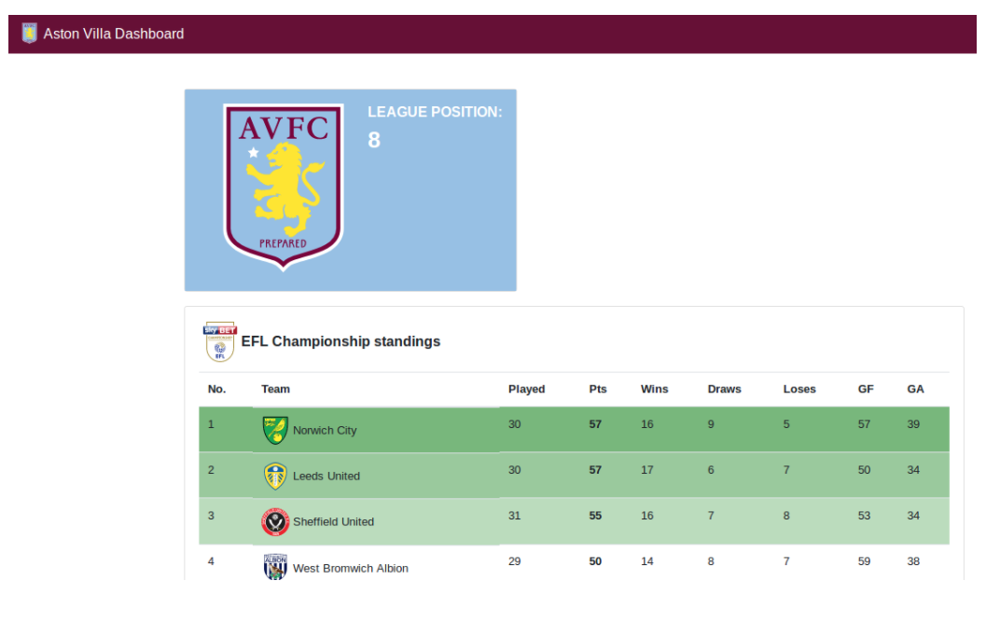

# Build and Run Angular Application in a Docker Container

Bu kisa makalede Angular aplikasyonunun Docker konteyneri icinde kullanimini gorecegiz. Is yukunu hafifletmek adina, multi-stage Docker 'a goz atacagiz. Sozu daha fazla uzatmadan, Angular uygulamamizi Docker konteyneri icine koyalim. Bu makalenin amacina uygun olmasi adina, daha onceden olusturulmus [bu uygulamayi](https://github.com/wkrzywiec/aston-villa-app) kullanacagiz.




Oncelikli olarak, uygulamayi klonlamamiz gerekiyor. Terminali acalim ve asagidaki komutu yazalim:

```
$ git clone https://github.com/wkrzywiec/aston-villa-app.git

```

Daha sonra, local dosyamiza girelim. Node.js ve Angular CLI'in local bilgisayarda yukliu olmasi da gerekmekte. [Buradan](https://angular.io/guide/setup-local) set up yapabiliriz.

Eger onkosullar saglandiysa, Angular uygulamamizi derleyebiliriz.

```
$ ng build --prod
```
